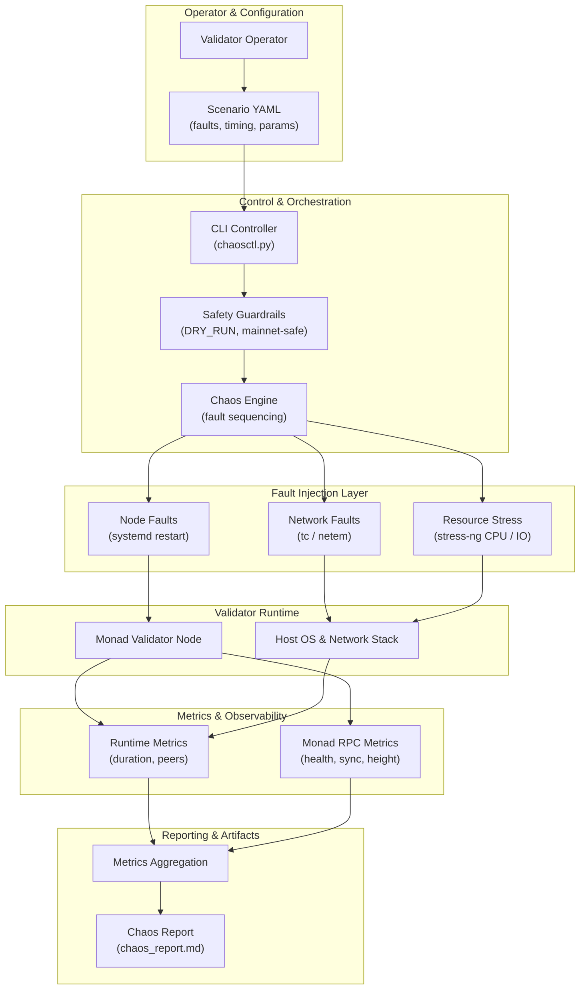

# 🌌 Astrosynx — Stress & Chaos Testing Suite (for Monad)

Production-oriented **chaos & stress testing toolkit** purpose-built for **Monad validator infrastructure**.  
Designed to safely simulate **Monad-realistic failure conditions**, measure recovery behavior, and improve **Monad operator resilience** **before incidents happen**.

---

## 🧠 What Is This?

Astrosynx Stress & Chaos Testing Suite is a **scenario-driven framework** for **Monad validator operators** that deliberately introduces controlled failures into node infrastructure and observes how a **Monad validator** behaves under pressure.

The goal is **not to break Monad**, but to answer critical **Monad operations** questions:

- How fast does a **Monad validator node** recover after failure?
- Does it rejoin **Monad peers** correctly and stabilize networking?
- Are monitoring and alerting systems reacting in time to **Monad-specific symptoms** (RPC health, sync drift, height stall)?
- Which **Monad node configurations** degrade silently under load or restarts?

This suite helps you validate **Monad readiness** in a repeatable, auditable way.

---

## ✨ Key Features

✅ Scenario-based fault injection (YAML)  
🌐 Network degradation (latency, packet loss) **for Monad P2P conditions**  
🔁 Validator service restarts (systemd) **for Monad validator service units**  
🔥 CPU & IO stress testing (`stress-ng`) **to mimic Monad execution pressure**  
📡 RPC-level **Monad observability** (health, sync status, height checks)  
📊 Recovery & MTTR measurement **for Monad incidents & drills**  
🛡️ Safe-by-default execution (`DRY_RUN`)  
🧩 Modular & extensible architecture **for Monad tooling and future network profiles**  

---

## 🧱 High-Level Architecture


---
## 💥 Fault Injection Types (Monad-focused)

### 🌐 Network Faults
- Artificial latency injection **to emulate Monad peer degradation**
- Packet loss simulation **to stress Monad P2P stability**
- Connectivity degradation scenarios **that surface Monad sync drift and peer churn**

### 🔁 Node Faults
- Controlled **Monad validator service** restarts
- Recovery and resync behavior validation **under Monad protocol expectations**

### 🔥 Resource Pressure
- CPU saturation **to model Monad execution spikes**
- Disk / IO contention **to catch height stalls / slow sync**
- Combined stress scenarios via `stress-ng` **for Monad worst-case drills**

---

## 📊 Metrics Collected (Monad signals)

📈 Execution duration  
🔗 Peer count before / after faults **for Monad P2P**  
📡 **Monad RPC** reachability / health checks  
⛓️ Block height visibility **(height progress / stall detection)**  
🔄 Syncing status **(catch-up, drift, stuck detection)**  
⏱️ Recovery behavior indicators **(MTTR, stabilization window)**  

These signals allow **direct correlation** between injected failures and **Monad protocol-level behavior**, enabling faster post-mortems and better pre-production validation.

---

## 🛡️ Safety Model (Monad-aware)

Safety is enforced at the framework level:

- 🧯 `DRY_RUN=1` enabled by default  
- 🚫 **Monad mainnet** → automatic safe-mode  
- 🔄 Explicit rollback for all faults  
- ⚠️ No cascading or parallel faults by default  

This makes the suite suitable for **real Monad validator infrastructure testing** without unnecessary risk.

---

## 🧪 Example Scenario (Monad)

```yaml
scenario: cpu_io_pressure
network: testnet

faults:
  - type: node.resource_stress
    duration: 30
    params:
      cpu: 4
      io: 2
      timeout: 30
```
## ⚙️ Installation

```bash
git clone https://github.com/astrosynx/chaos-suite
cd astrosynx-chaos-suite
pip install -r requirements.txt
```

## ▶️ Usage

```
python orchestrator/chaosctl.py examples/network_latency.yaml
```

## 🧩 Typical Use Cases (Monad operator workflow)

- **Monad validator resilience** testing  
- **Monad upgrades** & restart validation  
- Monitoring and alerting verification **for Monad RPC + node health**  
- Infrastructure comparison **across Monad environments** (bare-metal vs VPS, kernel/network tuning)  
- Operational readiness assessments **for Monad incidents and runbooks**  

---

## 🛣️ Roadmap (Monad-first)

🔜 MTTR timelines & recovery graphs **for Monad drills**  
🔜 Missed block correlation **(Monad height stalls / recovery)**  
🔜 Peer churn analytics **for Monad P2P**  
🔜 Mainnet-safe fault profiles **for Monad operator playbooks**  
🔜 Cross-network support  

The framework is designed to **lead with Monad**, while remaining adaptable to other blockchain networks.
